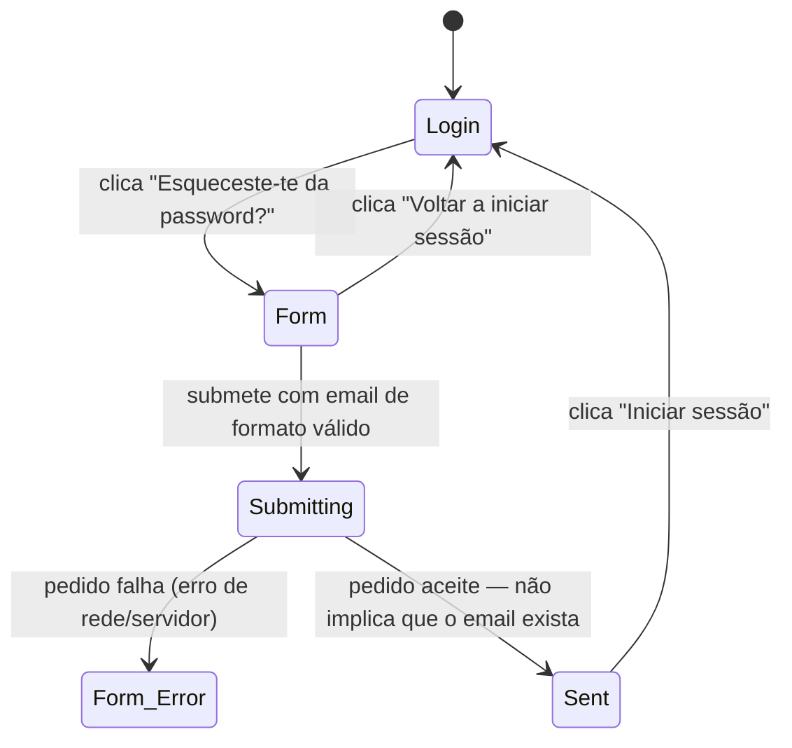

# Esqueci-me da password

**Rota:** `/forgot-password` (pública, fora da app shell)
**Guards:** nenhum
**Componentes:** `ForgotPasswordPageComponent`
**Depende de:** `AuthService.requestPasswordReset()`, `ToastService`
**Ponto de entrada real:** o link "Esqueceste-te da password?" em `/login` — não há nenhum outro
sítio na app que aponte para aqui. Os fluxos abaixo partem sempre de `/login`, não de um acesso
direto ao URL, exceto onde isso é explicitamente o que se está a testar.
**Segue para:** [`reset-password.md`](reset-password.md) — este ecrã só pede o link; definir a
password nova acontece depois de o utilizador clicar no email, num ecrã à parte.

## Fluxos de utilizador

### Fluxo 1 — Pedir o link de reset com sucesso
**Perfil:** anónimo, ponto de entrada por `/login`
1. Abre `/login`.
2. Clica "Esqueceste-te da password?".
3. **Resultado:** navega para `/forgot-password`; formulário vazio, sem nada trazido do login.
4. Escreve um email no campo Email.
5. Clica "Enviar link de reset".
6. **Resultado:** botão muda para "A enviar…" e desativa-se; ao responder, o ecrã troca para o estado "verifica o teu email", mostrando o email introduzido no texto de confirmação.

> **Nota de comportamento — não é bug:** o Supabase devolve sucesso mesmo que o email não
> corresponda a nenhuma conta (proteção contra enumeração de contas). O ecrã de confirmação aparece
> sempre que o formato do email é válido, independentemente de a conta existir. Um teste E2E não
> consegue distinguir "email real, mensagem enviada" de "email inventado, nada enviado" só a partir
> desta página — teria de verificar a caixa de correio (ver nota no fim).

### Fluxo 2 — Botão desativado com email de formato inválido
**Perfil:** anónimo
1. Chega a `/forgot-password` pelo Fluxo 1 (passos 1–3).
2. Escreve algo sem `@`/domínio no campo Email (ex. "abc", ou deixa vazio).
3. **Resultado:** botão "Enviar link de reset" permanece desativado; não é possível submeter.

### Fluxo 3 — Pedido falha (erro de rede/servidor)
**Perfil:** anónimo
1. Chega a `/forgot-password` pelo Fluxo 1.
2. Escreve um email de formato válido, com o backend indisponível ou a devolver erro.
3. Clica "Enviar link de reset".
4. **Resultado:** permanece no formulário (não avança para "verifica o teu email"); campo marcado a vermelho; toast de erro — mesma ressalva do Login: a mensagem do toast é o texto de erro em bruto do Supabase, não uma chave de tradução própria.

### Fluxo 4 — Corrigir o campo depois de um erro
**Perfil:** acabou de falhar o Fluxo 3
1. Volta a escrever no campo Email.
2. **Resultado:** a marca de erro desaparece assim que começa a escrever.

### Fluxo 5 — Voltar ao login sem submeter
**Perfil:** anónimo
1. Chega a `/forgot-password` pelo Fluxo 1.
2. Sem preencher nada (ou com o campo a meio), clica "Voltar a iniciar sessão".
3. **Resultado:** navega para `/login`; formulário de login limpo (não guarda o que estava em forgot-password).

### Fluxo 6 — Continuar para o login depois do link enviado
**Perfil:** completou o Fluxo 1
1. No ecrã de confirmação ("verifica o teu email"), clica "Iniciar sessão".
2. **Resultado:** navega para `/login` — a conta ainda não tem a password nova; isto só leva de volta ao formulário de login, não avança o reset (isso só acontece ao clicar no link do email, ver `reset-password.md`).

---

**Notas para o `rally-e2e-test`:** o Fluxo 1 não é totalmente verificável de ponta a ponta só com
Playwright a interagir com a app — confirmar que o email foi mesmo enviado precisa de uma caixa de
correio de teste (Mailhog/Mailosaur/inbox real via API) ou de interceção do pedido de rede para o
Supabase. Sem isso, o teste só consegue verificar a transição de UI (formulário → "verifica o teu
email"), não o envio real.
