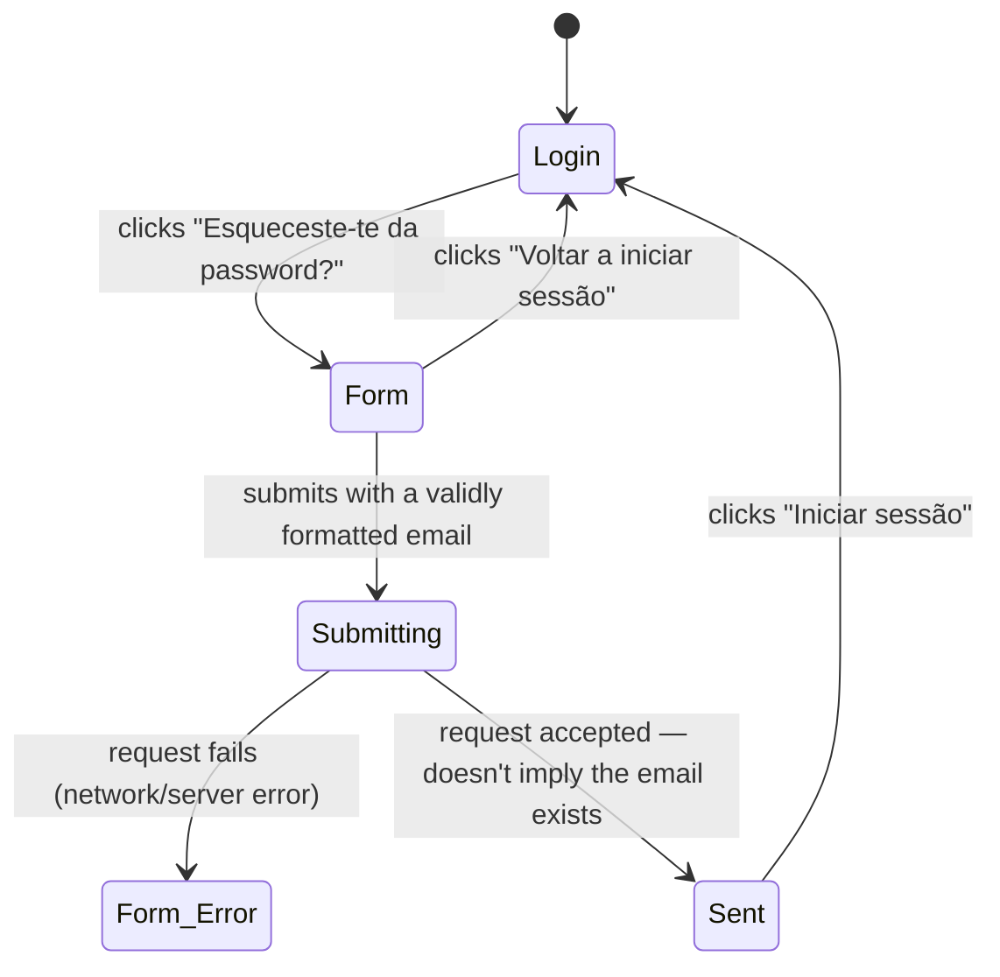

# Forgot password

**Route:** `/forgot-password` (public, outside the app shell)
**Guards:** none
**Components:** `ForgotPasswordPageComponent`
**Depends on:** `AuthService.requestPasswordReset()`, `ToastService`
**Real entry point:** the "Esqueceste-te da password?" link on `/login` — there's no other place in
the app that points here. The flows below always start from `/login`, not from a direct URL visit,
except where that's explicitly what's being tested.
**Leads to:** [`reset-password.md`](reset-password.md) — this screen only requests the link;
setting the new password happens after the user clicks the email link, on a separate screen.

## User flows

### Flow 1 — Successfully request the reset link
**Profile:** anonymous, entry point via `/login`
1. Opens `/login`.
2. Clicks "Esqueceste-te da password?".
3. **Result:** navigates to `/forgot-password`; empty form, nothing carried over from login.
4. Types an email into the Email field.
5. Clicks "Enviar link de reset".
6. **Result:** the button changes to "A enviar…" and disables itself; once it responds, the screen
   switches to the "verifica o teu email" state, showing the entered email in the confirmation
   text.

> **Behavior note — not a bug:** Supabase returns success even if the email doesn't match any
> account (protection against account enumeration). The confirmation screen appears whenever the
> email is validly formatted, regardless of whether the account exists. An E2E test can't
> distinguish "real email, message sent" from "made-up email, nothing sent" from this page alone —
> it would need to check the mailbox (see the note at the end).

### Flow 2 — Button disabled with an invalid email format
**Profile:** anonymous
1. Arrives at `/forgot-password` via Flow 1 (steps 1-3).
2. Types something without `@`/domain into the Email field (e.g. "abc", or leaves it empty).
3. **Result:** the "Enviar link de reset" button stays disabled; can't be submitted.

### Flow 3 — Request fails (network/server error)
**Profile:** anonymous
1. Arrives at `/forgot-password` via Flow 1.
2. Types a validly formatted email, with the backend unavailable or returning an error.
3. Clicks "Enviar link de reset".
4. **Result:** stays on the form (doesn't advance to "verifica o teu email"); field marked red;
   error toast — same caveat as Login: the toast message is Supabase's raw error text, not a
   translation key of its own.

### Flow 4 — Fix the field after an error
**Profile:** just failed Flow 3
1. Types into the Email field again.
2. **Result:** the error mark disappears as soon as typing starts.

### Flow 5 — Go back to login without submitting
**Profile:** anonymous
1. Arrives at `/forgot-password` via Flow 1.
2. Without filling anything in (or with the field half-filled), clicks "Voltar a iniciar sessão".
3. **Result:** navigates to `/login`; login form is empty (doesn't keep what was in
   forgot-password).

### Flow 6 — Continue to login after the link is sent
**Profile:** completed Flow 1
1. On the confirmation screen ("verifica o teu email"), clicks "Iniciar sessão".
2. **Result:** navigates to `/login` — the account still doesn't have the new password; this only
   leads back to the login form, it doesn't advance the reset (that only happens by clicking the
   email link, see `reset-password.md`).

---

**Notes for `rally-e2e-test`:** Flow 1 can't be fully verified end-to-end with just Playwright
interacting with the app — confirming the email was actually sent needs a test mailbox
(Mailhog/Mailosaur/a real inbox via API) or intercepting the network request to Supabase. Without
that, the test can only verify the UI transition (form → "verifica o teu email"), not the real send.
