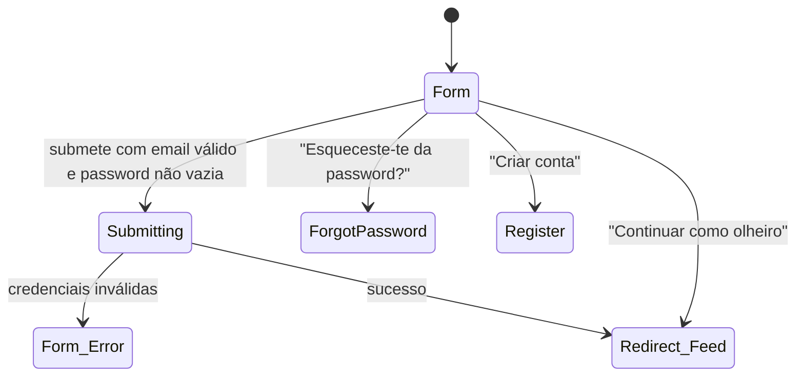

# Login

**Rota:** `/login` (pública, fora da app shell — sem topbar/drawer)
**Guards:** nenhum — mesmo uma sessão já autenticada pode abrir `/login` diretamente e vê o formulário (ver Fluxo 10)
**Componentes:** `LoginPageComponent`
**Depende de:** `AuthService.login()`, `AuthService.loginAsObserver()`, `ToastService`

Mapa geral do ecrã (visão técnica — para o percurso ação-a-ação ver "Fluxos de utilizador" abaixo):

## Fluxos de utilizador

Cada fluxo é uma sequência de ações concretas — o mapeamento para um teste Playwright é quase 1:1
(cada passo numerado ≈ um `page.fill`/`page.click`, o "Resultado" ≈ um `expect`).

### Fluxo 1 — Login com sucesso
**Perfil:** conta real existente, sessão anónima
1. Abre `/login`.
2. Escreve o email da conta no campo Email.
3. Escreve a password correta no campo Password.
4. Clica "Iniciar sessão".
5. **Resultado:** botão mostra estado "A iniciar sessão…" e fica desativado enquanto a chamada está em curso; ao responder, é redirecionado para `/` (Feed) com sessão real ativa.

### Fluxo 2 — Login com password errada
**Perfil:** conta real existente, sessão anónima
1. Abre `/login`.
2. Escreve o email da conta.
3. Escreve uma password incorreta.
4. Clica "Iniciar sessão".
5. **Resultado:** permanece em `/login`; os dois campos ficam com contorno vermelho (`fieldError`); aparece um toast de erro; **a mensagem do toast é o texto de erro em bruto devolvido pelo Supabase (inglês, ex. "Invalid login credentials") — não passa por nenhuma chave de tradução própria, ao contrário de outros fluxos de erro da app.** Vale a pena decidir se isto fica assim.

### Fluxo 3 — Login com email que não existe
**Perfil:** sessão anónima
1. Abre `/login`.
2. Escreve um email sintaticamente válido mas sem conta associada.
3. Escreve qualquer password.
4. Clica "Iniciar sessão".
5. **Resultado:** mesmo comportamento do Fluxo 2 (Supabase não distingue "email não existe" de "password errada" na resposta) — permanece em `/login`, toast de erro, campos marcados.

### Fluxo 4 — Corrigir o erro depois de uma tentativa falhada
**Perfil:** acabou de falhar o Fluxo 2 ou 3
1. Com os campos ainda marcados a vermelho, volta a escrever no campo Email (ou Password).
2. **Resultado:** a marca de erro desaparece assim que começa a escrever em qualquer um dos dois campos — não é preciso limpar o campo todo.

### Fluxo 5 — Botão desativado com formulário inválido
**Perfil:** sessão anónima
1. Abre `/login`.
2. Deixa o email vazio (ou escreve algo sem `@`/domínio, ex. "abc").
3. Escreve qualquer coisa na password.
4. **Resultado:** botão "Iniciar sessão" permanece desativado (`disabled`); não é possível submeter, nem por Enter.
5. Repete com email válido e password vazia.
6. **Resultado:** mesmo botão desativado.

### Fluxo 6 — Mostrar/ocultar a password
**Perfil:** qualquer
1. Abre `/login`.
2. Escreve algo no campo Password.
3. Clica no ícone de olho (`ui-password-toggle`).
4. **Resultado:** o texto fica visível em claro (`type="text"`).
5. Clica outra vez.
6. **Resultado:** volta a ficar oculto (`type="password"`), sem perder o valor escrito.

### Fluxo 7 — Entrar como observador
**Perfil:** sessão anónima
1. Abre `/login`.
2. Clica "👀 Continuar como olheiro" (sem preencher nada).
3. **Resultado:** redirecionado para `/` (Feed) em modo observador — sem passar pela API, sem validação de formulário.

### Fluxo 8 — Ir para "Esqueceste-te da password?"
**Perfil:** qualquer
1. Abre `/login`.
2. Clica no link "Esqueceste-te da password?".
3. **Resultado:** navega para `/forgot-password`; nada do que estava escrito no formulário de login é transportado.

### Fluxo 9 — Ir para "Criar conta"
**Perfil:** qualquer
1. Abre `/login`.
2. Clica "Criar conta".
3. **Resultado:** navega para `/register`.

### Fluxo 10 — Sessão já autenticada visita `/login` manualmente
**Perfil:** sessão real já ativa (ex. voltou atrás no browser, ou escreveu o URL)
1. Com sessão ativa, navega para `/login` (não há guard a impedir).
2. **Resultado:** o formulário de login aparece na mesma — não há redireção automática para `/`. Vale a pena confirmar se isto é intencional; a maioria das apps redireciona uma sessão já autenticada para longe do ecrã de login.

### Fluxo 11 — Idioma e tema a partir do login
**Perfil:** qualquer
1. Abre `/login`.
2. Muda o idioma no seletor do cabeçalho.
3. **Resultado:** todo o texto do formulário (labels, placeholders, botão) muda de imediato, sem reload.
4. Alterna o tema claro/escuro.
5. **Resultado:** a página troca de tema sem perder o que já estava escrito nos campos.

---

**Notas para o `rally-e2e-test`:** os Fluxos 1–3 precisam de uma conta de teste real na base de
dados (ou de mockar `supabase.auth.signInWithPassword` na camada de rede) — não há modo demo para
login com sucesso. O Fluxo 2 vs 3 são indistinguíveis na resposta da API; não vale a pena ter dois
testes separados que verificam exatamente o mesmo comportamento — um basta, o outro fica só como
documentação de que foi considerado.
