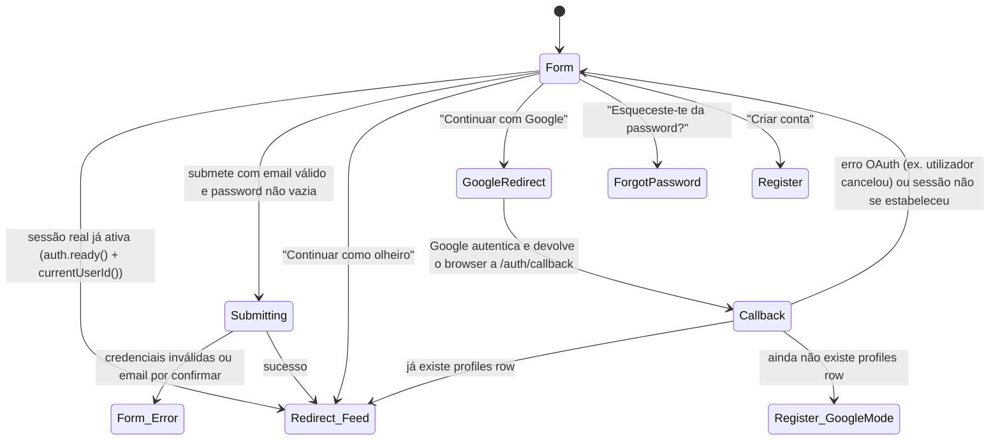

# Login

**Rota:** `/login` (pública, fora da app shell — sem topbar/drawer)
**Guards:** nenhum, mas uma sessão real já autenticada é redirecionada para `/` assim que o
`AuthService` fica pronto (ver Fluxo 10) — só uma sessão de observador fica no formulário, porque
essa é a única forma de sair do modo observador para uma conta real.
**Componentes:** `LoginPageComponent`, `AuthCallbackPageComponent` (o passo intermédio do login com
Google, em `/auth/callback`, fora da app shell tal como este ecrã)
**Depende de:** `AuthService.login()`, `AuthService.loginWithGoogle()`, `AuthService.loginAsObserver()`,
`AuthService.hasProfile()`, `ToastService`

Mapa geral do ecrã (visão técnica — para o percurso ação-a-ação ver "Fluxos de utilizador" abaixo):

## Fluxos de utilizador

Cada fluxo é uma sequência de ações concretas — o mapeamento para um teste Playwright é quase 1:1
(cada passo numerado ≈ um `page.fill`/`page.click`, o "Resultado" ≈ um `expect`).

### Fluxo 1 — Login com sucesso
**Perfil:** conta real existente, sessão anónima
1. Abre `/login`.
2. Escreve o email da conta no campo Email.
3. Escreve a password correta no campo Password.
4. Clica "Iniciar sessão".
5. **Resultado:** botão mostra estado "A iniciar sessão…" e fica desativado enquanto a chamada está em curso; ao responder, é redirecionado para `/` (Feed) com sessão real ativa.

### Fluxo 2 — Login com password errada
**Perfil:** conta real existente, sessão anónima
1. Abre `/login`.
2. Escreve o email da conta.
3. Escreve uma password incorreta.
4. Clica "Iniciar sessão".
5. **Resultado:** permanece em `/login`; os dois campos ficam com contorno vermelho (`fieldError`); aparece um toast de erro traduzido ("Email ou password incorretos.") — `AuthService.login()` mapeia a mensagem em bruto do Supabase ("Invalid login credentials") para `auth.errorInvalidCredentials` via `authErrorKey()` (`core/auth/auth-errors.ts`); qualquer mensagem fora dessa lista curta continua a passar tal e qual, sem tradução, como acontecia antes desta função existir.

### Fluxo 3 — Login com email que não existe
**Perfil:** sessão anónima
1. Abre `/login`.
2. Escreve um email sintaticamente válido mas sem conta associada.
3. Escreve qualquer password.
4. Clica "Iniciar sessão".
5. **Resultado:** mesmo comportamento do Fluxo 2 (Supabase não distingue "email não existe" de "password errada" na resposta) — permanece em `/login`, toast de erro, campos marcados.

### Fluxo 3b — Login antes de confirmar o email
**Perfil:** acabou de se registar (`/register`), ainda não clicou no link de confirmação
1. Abre `/login`.
2. Escreve o email e a password que usou no registo.
3. Clica "Iniciar sessão".
4. **Resultado:** mesmo tratamento visual do Fluxo 2 (campos marcados, toast de erro), mas com texto
   próprio — "Confirma o teu email antes de iniciar sessão…" (`auth.errorEmailNotConfirmed`) —
   porque o Supabase devolve uma mensagem diferente ("Email not confirmed") deste caso, também
   mapeada por `authErrorKey()`.

### Fluxo 4 — Corrigir o erro depois de uma tentativa falhada
**Perfil:** acabou de falhar o Fluxo 2 ou 3
1. Com os campos ainda marcados a vermelho, volta a escrever no campo Email (ou Password).
2. **Resultado:** a marca de erro desaparece assim que começa a escrever em qualquer um dos dois campos — não é preciso limpar o campo todo.

### Fluxo 5 — Botão desativado com formulário inválido
**Perfil:** sessão anónima
1. Abre `/login`.
2. Deixa o email vazio (ou escreve algo sem `@`/domínio, ex. "abc").
3. Escreve qualquer coisa na password.
4. **Resultado:** botão "Iniciar sessão" permanece desativado (`disabled`); não é possível submeter, nem por Enter.
5. Repete com email válido e password vazia.
6. **Resultado:** mesmo botão desativado.

### Fluxo 6 — Mostrar/ocultar a password
**Perfil:** qualquer
1. Abre `/login`.
2. Escreve algo no campo Password.
3. Clica no ícone de olho (`ui-password-toggle`).
4. **Resultado:** o texto fica visível em claro (`type="text"`).
5. Clica outra vez.
6. **Resultado:** volta a ficar oculto (`type="password"`), sem perder o valor escrito.

### Fluxo 7 — Entrar como observador
**Perfil:** sessão anónima
1. Abre `/login`.
2. Clica "👀 Continuar como olheiro" (sem preencher nada).
3. **Resultado:** redirecionado para `/` (Feed) em modo observador — sem passar pela API, sem validação de formulário.

### Fluxo 8 — Ir para "Esqueceste-te da password?"
**Perfil:** qualquer
1. Abre `/login`.
2. Clica no link "Esqueceste-te da password?".
3. **Resultado:** navega para `/forgot-password`; nada do que estava escrito no formulário de login é transportado.

### Fluxo 9 — Ir para "Criar conta"
**Perfil:** qualquer
1. Abre `/login`.
2. Clica "Criar conta".
3. **Resultado:** navega para `/register`.

### Fluxo 10 — Sessão já autenticada visita `/login` manualmente
**Perfil:** sessão real já ativa (ex. voltou atrás no browser, ou escreveu o URL)
1. Com sessão real ativa, navega para `/login` (não há guard a impedir — a redireção é feita pelo
   próprio `LoginPageComponent`, não por um guard de rota).
2. **Resultado:** assim que `AuthService.ready()` fica verdadeiro (imediato se a app já estava
   carregada; após restaurar a sessão persistida, num reload direto), é redirecionado para `/` sem
   ver o formulário. **Uma sessão de observador não é redirecionada** — `currentUserId()` é
   `undefined` para um observador, e é exatamente essa porta que lhe permite iniciar sessão real a
   partir daqui.

### Fluxo 11 — Idioma e tema a partir do login
**Perfil:** qualquer
1. Abre `/login`.
2. Muda o idioma no seletor do cabeçalho.
3. **Resultado:** todo o texto do formulário (labels, placeholders, botão) muda de imediato, sem reload.
4. Alterna o tema claro/escuro.
5. **Resultado:** a página troca de tema sem perder o que já estava escrito nos campos.

### Fluxo 12 — Login com Google, membro já registado
**Perfil:** já tem `profiles` row associada a esta conta Google (já entrou por Google antes, ou
associou a conta), sessão anónima
1. Abre `/login`.
2. Clica "Continuar com Google".
3. **Resultado:** o browser navega inteiro para o ecrã de consentimento da Google (não é um popup);
   o botão mostra "A ligar ao Google…" até essa navegação acontecer.
4. Autentica-se na Google e aceita o consentimento.
5. **Resultado:** a Google devolve o browser a `/auth/callback` (Supabase estabelece a sessão real a
   partir da URL); `AuthCallbackPageComponent` confirma que já existe uma linha em `profiles` para
   este utilizador e navega para `/` (Feed) — o mesmo destino de um login por email/password.

### Fluxo 13 — Login com Google, primeira vez (sem perfil)
**Perfil:** conta Google sem `profiles` row associada, sessão anónima
1. Abre `/login`.
2. Clica "Continuar com Google" e completa o consentimento (passos 2–4 do Fluxo 12).
3. **Resultado:** `AuthCallbackPageComponent` não encontra `profiles` row para este utilizador e
   navega para `/register` em **modo de conclusão de perfil** (`completeGoogleProfile` no estado da
   navegação) — o passo "Conta" do wizard fica de fora (a Google já deu o email; não há password a
   definir), o nome/apelido vêm pré-preenchidos a partir de `user_metadata` da Google quando
   disponíveis (`AuthService.googleProfileHint()`), e o wizard começa logo no passo "Traços"
   (nascimento/género/mão dominante). **Nunca** usa a foto de perfil da Google como avatar — os
   avatares da Rally são sempre gerados por seed, nunca carregados (ver CLAUDE.md).
4. Preenche o resto do wizard normalmente e submete no último passo.
5. **Resultado:** `AuthService.completeProfile()` grava a linha em `profiles` diretamente (sem
   `signUp()` — a sessão já existe) e navega para `/` (Feed).

> **Nota de comportamento:** se a página `/register` for recarregada a meio desta conclusão de
> perfil (F5), o modo de conclusão perde-se — `completeGoogleProfile` só existe no estado de uma
> navegação em memória, não sobrevive a um reload. O utilizador voltaria a ver o wizard completo,
> incluindo o passo de email/password, sobre uma sessão que já existe. É uma lacuna conhecida, não
> corrigida nesta ronda — rara o suficiente (é preciso recarregar a página a meio deste fluxo
> específico) para não justificar, por agora, persistir o estado de outra forma.

### Fluxo 14 — Login com Google falha ou é cancelado
**Perfil:** sessão anónima
1. Abre `/login`, clica "Continuar com Google".
2. Na Google, cancela o consentimento (ou o provider ainda não está ativado no Supabase).
3. **Resultado:** a Google/Supabase devolve o browser a `/auth/callback` com `error`/`error_description`
   na query string; `AuthCallbackPageComponent` mostra esse texto num toast e navega de volta para
   `/login`, formulário vazio.

---

**Notas para o `rally-e2e-test`:** os Fluxos 1–3 precisam de uma conta de teste real na base de
dados (ou de mockar `supabase.auth.signInWithPassword` na camada de rede) — não há modo demo para
login com sucesso. O Fluxo 2 vs 3 são indistinguíveis na resposta da API; não vale a pena ter dois
testes separados que verificam exatamente o mesmo comportamento — um basta, o outro fica só como
documentação de que foi considerado. Os Fluxos 12–14 (Google) não são realisticamente automatizáveis
de ponta a ponta — o consentimento acontece num domínio da Google fora do nosso controlo — por isso
o teste útil aqui é mockar `supabase.auth.signInWithOAuth` para nunca redirecionar de verdade e
navegar diretamente para `/auth/callback` com uma sessão/erro já preparados, verificando só a lógica
de `AuthCallbackPageComponent` (Fluxo 12 vs 13 vs 14) e não o ecrã da Google em si.

---

## Pré-requisitos fora do código

O provider Google só funciona depois de configurado manualmente — nenhum código resolve isto:

1. **Google Cloud Console** → criar um OAuth 2.0 Client ID (tipo "Web application") → em
   "Authorized redirect URIs" adicionar `https://<PROJECT_REF>.supabase.co/auth/v1/callback`
   (o callback é o do Supabase, não o nosso `/auth/callback` — é a Supabase que fala com a Google).
2. **Supabase Dashboard** → Authentication → Providers → Google → colar o Client ID e o Client
   Secret gerados no passo 1, ativar o provider.
3. **Supabase Dashboard** → Authentication → URL Configuration → garantir que "Redirect URLs" inclui
   `http://localhost:4200/auth/callback` (dev) e o equivalente em produção — sem isto o
   `redirectTo` que `AuthService.loginWithGoogle()` envia é rejeitado.

Até isto estar feito, o botão "Continuar com Google" mostra sempre o Fluxo 14 (erro).
