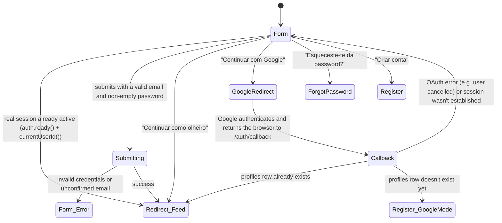

# Login

**Route:** `/login` (public, outside the app shell — no topbar/drawer)
**Guards:** none, but an already-authenticated real session is redirected to `/` as soon as
`AuthService` becomes ready (see Flow 10) — only an observer session stays on the form, because
that's the only way to leave observer mode for a real account.
**Components:** `LoginPageComponent`, `AuthCallbackPageComponent` (the intermediate step of Google
login, at `/auth/callback`, outside the app shell just like this screen). Visually, landing on
`/auth/callback` always triggers the full brand-intro animation (`SplashScreenComponent`, mounted in
`app.html`), which covers the whole screen start to finish (~3s, even if the navigation to `/` or
`/register` happens well before that) — see "UI note" further below. `AuthCallbackPageComponent`
itself still renders plain text underneath ("A concluir início de sessão…"), but only as a fallback;
in practice it's never actually visible.
**Depends on:** `AuthService.login()`, `AuthService.loginWithGoogle()`, `AuthService.loginAsObserver()`,
`AuthService.hasProfile()`, `ToastService`

Overall screen map (technical view — for the step-by-step journey see "User flows" below):

## User flows

Each flow is a sequence of concrete actions — the mapping to a Playwright test is nearly 1:1 (each
numbered step ≈ a `page.fill`/`page.click`, the "Result" ≈ an `expect`).

### Flow 1 — Successful login
**Profile:** existing real account, anonymous session
1. Opens `/login`.
2. Types the account's email into the Email field.
3. Types the correct password into the Password field.
4. Clicks "Iniciar sessão".
5. **Result:** the button shows the "A iniciar sessão…" state and is disabled while the call is in
   flight; once it responds, the user is redirected to `/` (Feed) with a real session active.

### Flow 2 — Login with the wrong password
**Profile:** existing real account, anonymous session
1. Opens `/login`.
2. Types the account's email.
3. Types an incorrect password.
4. Clicks "Iniciar sessão".
5. **Result:** stays on `/login`; both fields get a red outline (`fieldError`); a translated error
   toast appears ("Email ou password incorretos.") — `AuthService.login()` maps Supabase's raw
   message ("Invalid login credentials") to `auth.errorInvalidCredentials` via `authErrorKey()`
   (`core/auth/auth-errors.ts`); any message outside that short list still passes through
   untranslated, exactly as it did before this function existed.

### Flow 3 — Login with an email that doesn't exist
**Profile:** anonymous session
1. Opens `/login`.
2. Types a syntactically valid email with no associated account.
3. Types any password.
4. Clicks "Iniciar sessão".
5. **Result:** same behavior as Flow 2 (Supabase doesn't distinguish "email doesn't exist" from
   "wrong password" in the response) — stays on `/login`, error toast, fields marked.

### Flow 3b — Login before confirming the email
> **Currently unreachable, by product decision, not an implementation gap.** Confirmed on
> 2026-09-04: this Supabase project has "Confirm email" switched off — every signup comes back
> already confirmed, with a real session right away (see `supabase.auth.signUp()`/`POST
> /auth/v1/signup`, which already returns `email_confirmed_at` populated). This flow's code (the
> "Email not confirmed" mapping in `authErrorKey()`, the "verifica o teu email" screen in
> `RegisterPageComponent`, `localStorage['rally.pendingProfile']`) is all still there and still
> correct — there's just currently no way for a real account to fall into this state to exercise it.
> If confirmation is switched back on in the dashboard, this flow starts happening again with no
> code changes needed.

**Profile:** just registered (`/register`), hasn't clicked the confirmation link yet
1. Opens `/login`.
2. Types the email and password used at registration.
3. Clicks "Iniciar sessão".
4. **Result:** the same visual treatment as Flow 2 (fields marked, error toast), but with its own
   text — "Confirma o teu email antes de iniciar sessão…" (`auth.errorEmailNotConfirmed`) —
   because Supabase returns a different message ("Email not confirmed") for this case, also mapped
   by `authErrorKey()`.

### Flow 4 — Fix the error after a failed attempt
**Profile:** just failed Flow 2 or 3
1. With the fields still marked red, types into the Email (or Password) field again.
2. **Result:** the error mark disappears as soon as typing starts in either field — no need to
   clear the whole field.

### Flow 5 — Button disabled with an invalid form
**Profile:** anonymous session
1. Opens `/login`.
2. Leaves the email empty (or types something without `@`/domain, e.g. "abc").
3. Types anything in the password field.
4. **Result:** the "Iniciar sessão" button stays disabled (`disabled`); can't be submitted, not
   even via Enter.
5. Repeats with a valid email and an empty password.
6. **Result:** the button stays disabled the same way.

### Flow 6 — Show/hide the password
**Profile:** any
1. Opens `/login`.
2. Types something in the Password field.
3. Clicks the eye icon (`ui-password-toggle`).
4. **Result:** the text becomes visible in the clear (`type="text"`).
5. Clicks again.
6. **Result:** it goes back to hidden (`type="password"`), without losing the typed value.

### Flow 7 — Sign in as observer
**Profile:** anonymous session
1. Opens `/login`.
2. Clicks "👀 Continuar como olheiro" (without filling anything in).
3. **Result:** redirected to `/` (Feed) in observer mode — no API call, no form validation.

### Flow 8 — Go to "Esqueceste-te da password?"
**Profile:** any
1. Opens `/login`.
2. Clicks the "Esqueceste-te da password?" link.
3. **Result:** navigates to `/forgot-password`; nothing typed into the login form carries over.

### Flow 9 — Go to "Criar conta"
**Profile:** any
1. Opens `/login`.
2. Clicks "Criar conta".
3. **Result:** navigates to `/register`.

### Flow 10 — Already authenticated session visits `/login` manually
**Profile:** real session already active (e.g. went back in the browser, or typed the URL)
1. With a real session active, navigates to `/login` (there's no guard blocking this — the
   redirect is done by `LoginPageComponent` itself, not by a route guard).
2. **Result:** as soon as `AuthService.ready()` becomes true (immediately if the app was already
   loaded; after restoring the persisted session, on a direct reload), the user is redirected to
   `/` without ever seeing the form. **An observer session is not redirected** —
   `currentUserId()` is `undefined` for an observer, and that's exactly the door that lets them
   start a real session from here.

### Flow 11 — Language and theme from login
**Profile:** any
1. Opens `/login`.
2. Changes the language in the header selector.
3. **Result:** all the form's text (labels, placeholders, button) changes immediately, no reload.
4. Toggles light/dark theme.
5. **Result:** the page switches theme without losing what was already typed into the fields.

> **UI note — brand intro covers `/auth/callback`:** `SplashScreenComponent` normally only plays
> once per tab session (`sessionStorage['rally.splashShown']`), on the transition from a
> pre-authentication route to an authenticated one. `/auth/callback` is the exception: landing
> there always triggers the animation (the same `play()` signal, including marking
> `sessionStorage` — it doesn't play again on its own afterwards, on reaching `/`), ignoring the
> once-per-session limit. Once triggered, it runs to completion on its own fixed timers (~2.5s
> before it starts fading, ~3s until it disappears) — it is **not** cut short when
> `AuthCallbackPageComponent` decides where to navigate sooner. Since `SplashScreenComponent` lives
> outside the `router-outlet` (mounted in `app.html`), the navigation to `/` or `/register` happens
> underneath without unmounting it, so the animation keeps covering whatever loads next until it
> fades out on its own. Without this, Flows 12-14 would briefly show a plain text screen ("A
> concluir início de sessão…") instead of the brand intro, or would cut the animation short as soon
> as the navigation happened.

### Flow 12 — Login with Google, already registered member
**Profile:** already has a `profiles` row associated with this Google account (already signed in
with Google before, or linked the account), anonymous session
1. Opens `/login`.
2. Clicks "Continuar com Google".
3. **Result:** the browser navigates away entirely to Google's consent screen (not a popup); the
   button shows "A ligar ao Google…" until that navigation happens.
4. Authenticates with Google and accepts the consent.
5. **Result:** Google returns the browser to `/auth/callback` (Supabase establishes the real
   session from the URL); `AuthCallbackPageComponent` confirms a `profiles` row already exists for
   this user and navigates to `/` (Feed) — the same destination as an email/password login.

### Flow 13 — Login with Google, first time (no profile)
**Profile:** Google account with no associated `profiles` row, anonymous session
1. Opens `/login`.
2. Clicks "Continuar com Google" and completes the consent (steps 2-4 of Flow 12).
3. **Result:** `AuthCallbackPageComponent` finds no `profiles` row for this user and navigates to
   `/register` in **profile-completion mode** (`completeGoogleProfile` in the navigation state) —
   the wizard's "Conta" step is left out (Google already gave the email; there's no password to
   set), the first/last name come prefilled from Google's `user_metadata` when available
   (`AuthService.googleProfileHint()`), and the wizard starts straight at the "Traços" step
   (birth date/gender/dominant hand). It **never** uses the Google profile photo as the avatar —
   Rally's avatars are always seed-generated, never uploaded (see CLAUDE.md).
4. Fills in the rest of the wizard normally and submits at the last step.
5. **Result:** `AuthService.completeProfile()` writes the `profiles` row directly (no `signUp()` —
   the session already exists) and navigates to `/` (Feed).

> **Behavior note:** if the `/register` page is reloaded mid-way through this profile completion
> (F5), the completion mode is lost — `completeGoogleProfile` only exists in a navigation's
> in-memory state, it doesn't survive a reload. The user would see the full wizard again, including
> the email/password step, over a session that already exists. This is a known gap, not fixed in
> this round — rare enough (the page has to be reloaded mid-way through this specific flow) that it
> doesn't justify persisting the state some other way, for now.

### Flow 14 — Login with Google fails or is cancelled
**Profile:** anonymous session
1. Opens `/login`, clicks "Continuar com Google".
2. On Google, cancels the consent (or the provider isn't enabled yet in Supabase).
3. **Result:** Google/Supabase returns the browser to `/auth/callback` with
   `error`/`error_description` in the query string; `AuthCallbackPageComponent` shows that text in
   a toast and navigates back to `/login`, empty form.

---

**Status in `rally-e2e-tests`:** `tests/login.spec.ts` already covers, with real passing tests,
Flows 3 (which also covers Flow 2 — indistinguishable in the API response, not worth duplicating),
4, 5, 6, 7, 8, 9 and 11. The rest are documented `test.skip(...)`, each with its reason written in
the file itself:

- **Flow 3b** is left out on purpose — see the note above the flow itself: this Supabase project
  has "Confirm email" switched off by product decision, and there's currently no way for an account
  to fall into the "signed up, unconfirmed" state to test this against.
- **Flows 1 and 10** need one real, hand-seeded test account (no service-role key needed — see the
  `rally-e2e-tests` README): Account A (confirmed, with a `profiles` row, created by actually
  completing `/register`). Without `RALLY_TEST_EMAIL`/`RALLY_TEST_PASSWORD` in the environment,
  these two are skipped automatically.
- **Flows 12, 13 and 14** are skipped by decision, not for lack of test accounts — confirmed on
  2026-09-04. None of the three can drive Google's real consent screen, which remains outside our
  control to automate: 12 and 13 used to establish a real session by password (with Account A or
  Account B — no `profiles` row, created via Supabase Dashboard → Add user) and then visit
  `/auth/callback` directly, which was already enough to exercise `AuthCallbackPageComponent`'s
  routing decision (it never looks at which provider created the session) — but passing that off as
  Google login coverage was misleading: prefilling the name from Google's `user_metadata`, for
  instance, was never actually exercised, because a session created by password has none of that
  data. Flow 14 is the only one of the three that doesn't fake anything (it only visits
  `/auth/callback` with an error query string, exactly what Google/Supabase really send back on a
  cancelled consent), but it's skipped too so the group doesn't suggest partial Google coverage.
  Un-skipping needs a real way to automate Google's consent screen (e.g. a dedicated test account).

This screen only moves to ✅ in `docs/README.md` once Flows 1, 3b, 10, 12, 13 and 14 also have a
real passing test — see that file's "Maintenance" section.

---

## Prerequisites outside the code

The Google provider only works once configured by hand — no code handles this:

1. **Google Cloud Console** → create an OAuth 2.0 Client ID (type "Web application") → under
   "Authorized redirect URIs" add `https://<PROJECT_REF>.supabase.co/auth/v1/callback` (this is
   Supabase's own callback, not our `/auth/callback` — it's Supabase that talks to Google).
2. **Supabase Dashboard** → Authentication → Providers → Google → paste the Client ID and Client
   Secret generated in step 1, enable the provider.
3. **Supabase Dashboard** → Authentication → URL Configuration → make sure "Redirect URLs" includes
   `http://localhost:4200/auth/callback` (dev) and the equivalent in production — without this the
   `redirectTo` sent by `AuthService.loginWithGoogle()` is rejected.

Until this is done, the "Continuar com Google" button always shows Flow 14 (error).
