# Own profile

**Route:** `/profile` (inside the app shell)
**Guards:** `authGuard` (parent, like every authenticated route) + `noObserverGuard` (an observer
session is redirected away — there is no profile to edit) + `unsavedChangesGuard`
(`canDeactivate`, asks before an in-app navigation away from a dirty draft; it does **not** cover a
browser refresh or tab close).
**Components:** `ProfilePageComponent`, plus three components it composes rather than inlines:
`ChangePasswordDialogComponent`, `MyTripsSectionComponent`, and the shared
`rally-avatar-picker`/`rally-match-card`. The avatar-change dialog is inline in the page itself
(small enough it was never split out).
**Depends on:** `ProfileService.updateMe()`, `AuthService` (`logout()`, `deleteAccount()`,
`changePassword()`, `isGoogleAccount`), `MatchesService`, `CourtsService`, `CountryDataService`,
`GeolocationService` + `ReverseGeocodeService` (same reverse-geocode-on-consent flow as
registration — see [`register.md`](register.md), Flow 7), `ConfirmDialogService`,
`TripsRepository` (via `MyTripsSectionComponent`).
**Real entry point:** the "O meu perfil" item in the nav drawer/topbar, reachable from anywhere in
the authenticated shell.

This screen has no single-button "save" — four sections (Sobre ti / Localização / O teu jogo /
Agenda) each hold their own draft and save independently, so editing one never requires scrolling
to find a button for a different one. Every field, option list and validation rule in those four
sections is the **same** as the registration wizard (`register.md`) by design — see that file for
the per-field detail (years-gated level/style, the merged "Tipo de campo preferido", the location
consent + slider, etc.); this file covers what's specific to editing an *existing* profile instead
of creating one: independent per-section save/cancel, the avatar and password dialogs, deleting a
trip or the account, and the unsaved-changes guard.

```mermaid
stateDiagram-v2
  [*] --> Profile_View
  Profile_View --> Section_Saving: edits a section, clicks "Guardar alterações"
  Section_Saving --> Profile_View: success ("Guardar alterações" briefly shows "🎾 Guardado")
  Section_Saving --> Section_Error: save fails (toast; draft is kept, not reverted)
  Section_Error --> Profile_View
  Profile_View --> Avatar_Dialog: clicks the ✏️ badge on the avatar
  Avatar_Dialog --> Profile_View: "Guardar alterações" (saved) or "Cancelar" (draft reverted)
  Profile_View --> Password_Dialog: clicks "Alterar password" (hidden for a Google account)
  Password_Dialog --> Profile_View: success (toast) or "Cancelar"
  Profile_View --> Confirm_Delete_Trip: clicks a trip card's trash icon
  Confirm_Delete_Trip --> Profile_View: confirmed (trip removed) or cancelled
  Profile_View --> Confirm_Delete_Account: clicks "Apagar conta"
  Confirm_Delete_Account --> Redirect_Login: confirmed, deletion succeeds
  Confirm_Delete_Account --> Profile_View: cancelled
  Profile_View --> Redirect_Login: "Terminar sessão"
  Profile_View --> Confirm_Discard: navigates elsewhere in-app with an unsaved draft
  Confirm_Discard --> [*]: "Descartar alterações" — navigation proceeds
  Confirm_Discard --> Profile_View: "Continuar a editar" — navigation cancelled
```

## User flows

### Flow 1 — Save the "Sobre ti" section
**Profile:** real signed-in member
1. Opens `/profile`.
2. In the "Sobre ti" card, changes the birth date, "Género", "Mão dominante" and/or "Backhand",
   and edits the "Bio" textarea (280-character counter under it, no separate placeholder text
   telling you it's optional — same asterisk-only convention as everywhere else).
3. Clicks "Guardar alterações".
4. **Result:** the button's own label swaps to "🎾 Guardado" for ~2s (with a small pop animation)
   before reverting to "Guardar alterações" — there's no separate badge element next to it, so
   nothing else in the row shifts position when it appears or disappears.

### Flow 2 — Cancel discards the section's draft
**Profile:** real signed-in member, mid-edit in any of the four sections
1. Changes a few fields in a section (e.g. picks a different "Género").
2. Clicks "Cancelar" for that section.
3. **Result:** every field in that section reverts to the last persisted value
   (`resetTraits()`/`resetLocation()`/`resetGame()`/`resetSchedule()`); the other three sections'
   drafts, if also mid-edit, are untouched.

### Flow 3 — A section save fails
**Profile:** real signed-in member
1. Edits a section and clicks "Guardar alterações" while the underlying `updateMe()` call fails
   (network/server error).
2. **Result:** an error toast appears with the translated message; the draft is **not** reverted
   (unlike a cancel) — the button goes back to its normal "Guardar alterações" state so the same
   edit can be retried.

### Flow 4 — Grant location and auto-fill country/city
**Profile:** real signed-in member, "Localização" section
1. Clicks "📍 Sim, usar localização".
2. Accepts the browser's geolocation permission prompt.
3. **Result:** same as registration's Flow 7 — the chip's label reads "A localizar…" while the fix
   and the Nominatim reverse-geocode lookup are in flight, then the "País"/"Cidade" autocomplete
   fields are filled in automatically on a match (still plain editable fields either way — this is
   best-effort, not a lock).

### Flow 5 — Edit location manually and the distance slider
**Profile:** real signed-in member, "Localização" section
1. Picks a country and city by hand (with or without having used Flow 4 first).
2. Drags the "Distância que estás disposto a percorrer" slider.
3. **Result:** same 5/10/20/50/100(+) km stops as registration; the value shown updates live and
   the question never blocks "Guardar alterações" — a profile that predates this field falls back
   to 20 km rather than showing nothing.

### Flow 6 — Years-gated level and style in "O teu jogo"
**Profile:** real signed-in member
1. In "O teu jogo", changes "Anos a jogar" from 0 to any value above 0.
2. **Result:** "Nível de jogo" and "Como te descreverias em campo?" appear, exactly as in
   registration (`register.md`, Flow 10) — including the "🤷 Não sei" style option — and "Nível de
   jogo" becomes required to save this section.
3. Drops "Anos a jogar" back to 0.
4. **Result:** both questions disappear again and are no longer required; whatever had been picked
   stays in the draft in case years goes back up before saving.

### Flow 7 — Merged "Tipo de campo preferido"
**Profile:** real signed-in member
1. In "O teu jogo", picks a surface chip and an indoor/outdoor chip under the single "Tipo de campo
   preferido" heading.
2. **Result:** same merge as registration (`register.md`, Flow 11) — `Carpet` reads "Outro" here
   too; both rows are optional and independent of each other.

### Flow 8 — "Agenda": coached first, then general frequency
**Profile:** real signed-in member
1. In "Agenda", answers "Fazes treinos acompanhado?" — if "Sim, tenho treinador", picks a
   "Quantas vezes" chip (required once coached is true).
2. Answers "Com que frequência jogas?" and "A que horas és mais perigoso em campo?" (both optional).
3. **Result:** same ordering and requirement rules as registration's step 5 (`register.md`, Flow
   12). The "Quando costumas estar livre?" question from the old wizard is gone here too — there is
   no editor for it left on this page.

### Flow 9 — Change avatar
**Profile:** real signed-in member
1. Clicks the ✏️ badge on the avatar in the hero.
2. **Result:** a centred dialog opens (`animate-tennis-pop`) with `rally-avatar-picker` — the same
   style-picker and "🔄 Gerar outro" control used at the end of registration.
3. Picks a different style or regenerates the seed, clicks "Guardar alterações".
4. **Result:** the dialog closes immediately on success (no separate confirmation state) and the
   hero avatar updates. Clicking "Cancelar" instead reverts the draft seed/style to what's
   currently persisted and closes without saving.

### Flow 10 — Change password
**Profile:** real signed-in member, **not** a Google account
1. Clicks "Alterar password" in the hero.
2. **Result:** `rally-change-password-dialog` opens, asking for the current password, a new one
   (6+ characters, inline "A palavra-passe deve ter pelo menos 6 caracteres." if too short) and a
   confirmation (inline "As palavras-passe não coincidem" if they differ).
3. Fills in a correct current password and a valid, matching new password, clicks "Guardar
   password" (`auth.savePassword`).
4. **Result:** `AuthService.changePassword()` re-verifies the current password by signing in with
   it before actually updating — a wrong current password marks that field red (without clearing
   the new-password fields) and shows an error toast; success shows a "Password atualizada" toast
   and closes the dialog.

### Flow 11 — "Alterar password" is hidden for a Google account
**Profile:** signed in via Google (`AuthService.isGoogleAccount()` true — checked from
`app_metadata.provider`, which Supabase sets once at signup and never changes afterwards, so this
stays accurate even if the account later links a password too)
1. Opens `/profile`.
2. **Result:** the "Alterar password" button next to "Terminar sessão" isn't rendered at all —
   there's no Rally password on this account to change. "Terminar sessão" is unaffected.

### Flow 12 — Delete a trip
**Profile:** real signed-in member with at least one published trip in "As minhas viagens"
1. Clicks the trash icon on a trip card.
2. **Result:** a confirm dialog appears ("Tens a certeza? Isto remove a viagem da Rally e não pode
   ser desfeito."). Confirming removes the card immediately (`TripsRepository.deleteTrip()`,
   filtered out of the local list on success); cancelling leaves it untouched. This section has its
   own `loading`/`deletingTripId` state, independent of the four save sections below it.

### Flow 13 — Delete account
**Profile:** real signed-in member
1. Scrolls to the danger-zone card, clicks "Apagar conta".
2. **Result:** a destructive confirm dialog appears ("Tens a certeza? Isto vai apagar a tua conta e
   perfil permanentemente."). Confirming disables the button ("A apagar…"), calls
   `AuthService.deleteAccount()`, and on success redirects to `/login` with the session gone for
   good. A failure shows an error toast and leaves the account intact. Cancelling does nothing.

### Flow 14 — Logout
**Profile:** real signed-in member
1. Clicks "Terminar sessão" in the hero.
2. **Result:** signs out and redirects to `/login`, regardless of any unsaved section drafts — this
   button is not covered by the unsaved-changes guard (only in-app router navigation is).

### Flow 15 — Unsaved-changes guard blocks in-app navigation
**Profile:** real signed-in member, mid-edit in any section (not yet saved)
1. Changes a field in, say, "O teu jogo" without clicking "Guardar alterações".
2. Clicks a different in-app link (nav drawer, topbar, "Ver todas" on matches, etc.).
3. **Result:** a confirm dialog appears ("Tens alterações por guardar. Se saíres agora, vão
   perder-se."). "Continuar a editar" cancels the navigation and keeps the draft; "Descartar
   alterações" proceeds to the other route and the draft is lost. `hasUnsavedChanges()` compares
   every draft signal across all four sections against the persisted profile, so this fires
   regardless of which section was touched.

### Flow 16 — Order of the page below the hero
**Profile:** any
1. Opens `/profile`.
2. **Result:** below the hero, the order is fixed as: "As tuas partidas" (recent matches, up to 6,
   linking to `/matches`) → "As minhas viagens" → the Passaporte teaser card (linking to
   `/passport`, showing live country/court counts from `CourtsService`) → the four edit sections →
   the danger zone.

### Flow 17 — Observer view
**Profile:** unreachable in practice — `noObserverGuard` redirects an observer session away from
`/profile` before this ever renders (see the guard note in the header). The template still carries
an `@if (auth.isObserver())` read-only branch (a "Como jogas" chip summary, no edit sections, no
danger zone, no change-password) as defence in depth, but there is currently no way to reach it —
not a flow to test, just a note so this branch isn't mistaken for dead code.

### Flow 18 — Language and theme from profile
**Profile:** any
1. Changes the language in the header selector.
2. **Result:** all visible copy (labels, button text, hero) changes immediately, no reload, and no
   draft is lost.
3. Toggles light/dark theme.
4. **Result:** the page switches theme without losing anything typed or picked so far in any
   section.

---

**Status in `rally-e2e-tests`:** no spec file exists yet for this screen. Flows 1-9 and 15-16 need
only a seeded real account (the same `RALLY_TEST_EMAIL`/`RALLY_TEST_PASSWORD` login.spec.ts and
register.spec.ts already use) and can be automated directly. Flow 10 changes the real account's
password, so — like `reset-password.spec.ts`'s Flow 1/7 — it needs the service-role key to restore
it afterwards in a `finally`, and should run serially with any other spec touching Account A's
password. Flow 11 needs a Google-created account (the same limitation as
[`register.md`](register.md)'s Flows 16-17 — Google's consent screen can't be driven for real, so
this would use the same password-created stand-in and inherit the same caveat). Flow 13 is
destructive by nature (deletes a real account) and should only ever run against a disposable
account created for that one test, cleaned up regardless of outcome. Flow 17 is not testable by
design — see its note above.
