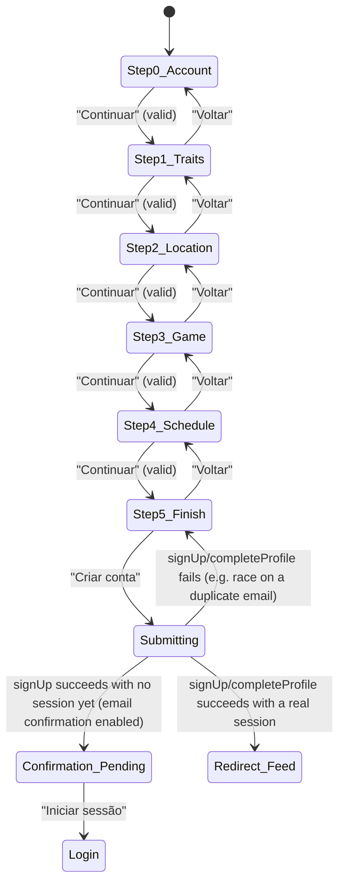

# Registration

**Route:** `/register` (public, outside the app shell — no topbar/drawer)
**Guards:** none. A signed-in real session isn't redirected away from this screen the way it is on
`/login` — that's deliberate, since a Google account with no `profiles` row yet (see "Google mode"
below) is a real signed-in session with legitimate business being here.
**Components:** `RegisterPageComponent`. Reached in "Google mode" via `AuthCallbackPageComponent`
(`/auth/callback`, documented in [`login.md`](login.md)).
**Depends on:** `AuthService.register()`, `AuthService.completeProfile()`, `AuthService.emailExists()`,
`AuthService.googleProfileHint()`, `CountryDataService`, `GeolocationService`, `ToastService`.
**Real entry point:** "Criar conta" on `/login` (anonymous session) for the normal wizard, or
`AuthCallbackPageComponent` navigating here with `completeGoogleProfile` in its navigation state
after a first-ever Google sign-in (see [`login.md`](login.md), Flow 13) for Google mode. The flows
below always start from one of those two, not a direct URL visit, except where that's explicitly
what's being tested.

The wizard is six linear steps ("Conta" → "Sobre ti" → "Localização" → "O teu jogo" → "Agenda" →
"Últimos toques"), gated by a per-step `canContinue()` check. Google mode reuses the exact same
six steps — it doesn't skip "Conta", it renders a version of it with no email/password fields (see
Flow 12).

## User flows

### Flow 1 — Successful registration, email/password
**Profile:** anonymous session, entry via `/login` → "Criar conta"
1. Opens `/login`, clicks "Criar conta". **Result:** navigates to `/register`, step 1 of 6 ("Conta").
2. Types a first and last name (each more than 1 character), an unused, validly formatted email, a
   password of 6+ characters, and repeats it in "Confirmar palavra-passe".
3. Clicks "Continuar". **Result:** advances to step 2 ("Sobre ti").
4. Picks a birth date (see Flow 5), a "Género" chip, and a "Mão dominante" chip ("Direita"/
   "Esquerda"/"As duas"). Backhand is optional. Clicks "Continuar".
5. **Result:** advances to step 3 ("Localização") — see Flows 7-9 for what happens here.
6. Picks country, city, and leaves or moves the distance slider, clicks "Continuar".
7. **Result:** advances to step 4 ("O teu jogo") — see Flow 10 for the years-gated fields. Fills in
   what's required (years is enough on its own at 0; a value above 0 also requires "Nível de jogo").
   Clicks "Continuar".
8. **Result:** advances to step 5 ("Agenda") — see Flow 12. Answers "Fazes treinos acompanhado?"
   (and "Quantas vezes" if yes). Clicks "Continuar".
9. **Result:** advances to step 6 ("Últimos toques"). Optionally changes the avatar and writes a bio.
10. Clicks "Criar conta".
11. **Result:** the button shows "A criar conta…" and disables while the call is in flight. With
    email confirmation off (this project's current Supabase setting — see
    [`login.md`](login.md), Flow 3b), `signUp()` returns an already-confirmed session immediately, so
    the user is redirected straight to `/` (Feed) with a real profile.

### Flow 2 — Duplicate email
**Profile:** anonymous session, step 1
1. Types an email that already belongs to a registered account.
2. Blurs the Email field (tabs away or clicks elsewhere).
3. **Result:** while the check is in flight there's no visible spinner state on the field itself;
   once it resolves, the field gets a red outline and an inline message appears under it ("Este
   email já está registado."), plus an error toast with the same text. "Continuar" stays disabled
   for this step until the email is changed.
4. Types a different, unused email.
5. **Result:** the red outline and inline message clear immediately (`setEmail()` resets
   `emailFieldError`/`emailTaken` on every keystroke, not just on the next blur).

### Flow 3 — Password validation
**Profile:** anonymous session, step 1
1. Types a password under 6 characters.
2. **Result:** inline message "A palavra-passe deve ter pelo menos 6 caracteres." appears under the
   field; "Continuar" stays disabled.
3. Types 6+ characters, then types a different value into "Confirmar palavra-passe".
4. **Result:** inline message "As palavras-passe não coincidem" appears under the confirm field;
   "Continuar" stays disabled until both match.

### Flow 4 — Step 1 blocked by name length
**Profile:** anonymous session, step 1
1. Leaves "Primeiro nome" or "Último nome" at a single character (or empty).
2. **Result:** "Continuar" stays disabled regardless of what else is filled in — both names need
   more than 1 character.

### Flow 5 — Birth date: minimum age of 6
**Profile:** anonymous session, step 2
1. Opens the "Data de nascimento" picker.
2. **Result:** the year dropdown only lists years up to (today's year − 6); the whole last 6 years
   are unreachable, and any day inside that window is rendered disabled — a player has to be at
   least 6 years old. This is enforced by `maxBirthDate` (today minus 6 years), passed as the date
   picker's `max`.

### Flow 6 — Optional backhand
**Profile:** anonymous session, step 2
1. Fills in birth date, "Género" and "Mão dominante" (all required), but leaves "Backhand" unset.
2. **Result:** "Continuar" is enabled anyway — backhand has no asterisk and isn't part of
   `canContinue()` for this step.

### Flow 7 — Grant location permission
**Profile:** anonymous session, step 3
1. Clicks "📍 Sim, usar localização".
2. **Result:** the chip's label switches to "A localizar…" while the browser's real geolocation
   permission prompt is pending (`GeolocationService.locate()`); "Manual" fields (country/city) stay
   visible and required regardless of the outcome — granting location doesn't currently autofill
   them (no reverse-geocoding in this app; see the hint text under the question).
3. Accepts the browser's permission prompt.
4. **Result:** the "Sim, usar localização" chip becomes active. Nothing else on the page changes yet
   — the fix isn't persisted to the profile in this pass, it's UX-only groundwork for a future
   real-distance feature.

### Flow 8 — Decline location permission
**Profile:** anonymous session, step 3
1. Clicks "🙅 Agora não" (or dismisses/denies the browser's permission prompt after clicking "Sim").
2. **Result:** the "Agora não" chip becomes active instead; country/city/slider are unaffected —
   this question never blocks "Continuar" either way (no asterisk, not part of `canContinue()`).

### Flow 9 — Country, city and the distance slider
**Profile:** anonymous session, step 3
1. Picks a country from the autocomplete.
2. **Result:** the city field switches from "Escolhe primeiro um país" (disabled) to "Seleciona a
   tua cidade" (enabled), with that country's city list loaded lazily; any previously typed city is
   cleared (`setCountry()` resets it).
3. Picks a city.
4. Drags the "Distância máxima que estás disposto a percorrer" slider.
5. **Result:** the number above the slider updates live to one of 5/10/20/50/100 km (100 shows as
   "100+"); the slider starts pre-set at 20 km, so this question never blocks "Continuar" by itself.

### Flow 10 — Years-gated level and style
**Profile:** anonymous session, step 4
1. Arrives at step 4 with "Anos a jogar" defaulted to 0 — "Continuar" is already enabled (0 is a
   valid answer on its own; "Nível de jogo" isn't asked).
2. Clicks the "+" button next to the years counter.
3. **Result:** as soon as the value goes above 0, "Nível de jogo" and "Como te descreverias em
   campo?" appear beneath it. "Continuar" now also requires a "Nível de jogo" chip.
4. Picks "🤷 Não sei" under "Como te descreverias em campo?".
5. **Result:** accepted as a real answer, same as any other style chip — it's not the same as
   leaving the question blank (that's still allowed too, since this question has no asterisk).
6. Clicks "−" back down to 0 years.
7. **Result:** "Nível de jogo" and the style question disappear again; whatever had been picked in
   them is kept in memory (not cleared) but no longer required or shown — if years goes back above
   0 later in the same session, the previous picks reappear.

### Flow 11 — Merged "Tipo de campo preferido"
**Profile:** anonymous session, step 4
1. Under "Tipo de campo preferido", picks a surface chip (Terra batida/Rápido/Relva/"Outro" — the
   fourth option is the same underlying `Carpet` value used elsewhere in the app, just relabelled
   "Outro" for this specific question) and, on the row below it, an indoor/outdoor/"Tanto faz" chip.
2. **Result:** both rows live under the one heading and both are optional — neither blocks
   "Continuar", and they can be set independently of each other.

### Flow 12 — Coaching first, then general frequency
**Profile:** anonymous session, step 5
1. Arrives at step 5 with "Fazes treinos acompanhado?" as the first question.
2. Clicks "🎾 Sim, tenho treinador".
3. **Result:** a "Quantas vezes" follow-up (the same weekly-frequency chip set used elsewhere)
   appears right under it; "Continuar" now also requires one of those chips.
4. Clicks "🙅 Não, sou autodidata" instead.
5. **Result:** the "Quantas vezes" follow-up disappears and any previously picked value there is
   cleared (`setCoached(false)` resets `coachedFrequency`); "Continuar" no longer needs it.
6. Answers "Com que frequência jogas?" (own play frequency, unrelated to coaching) and, optionally,
   "A que horas és mais perigoso em campo?".
7. **Result:** neither of these two blocks "Continuar" — only the coached question (and its
   follow-up, if coached) is required at this step.

### Flow 13 — Finish: avatar and bio
**Profile:** anonymous session, step 6
1. Arrives at step 6; the avatar seed defaults to the player's full name (set once, the first time
   this step is reached — `next()` only seeds it if it's still the placeholder `'rally-player'`).
2. Picks a different avatar style/seed via `rally-avatar-picker`.
3. Writes a bio, guided by the placeholder text (a concrete example, not just "optional" — there's
   no "Opcional" label on this field, matching the rest of the form's asterisk-only convention for
   marking required fields).
4. Clicks "Criar conta" — see Flow 1, step 11 for what happens next.

### Flow 14 — Submit fails after passing the email check
**Profile:** anonymous session, reaches step 6 and submits
1. Completes the wizard and clicks "Criar conta", but the email was taken by someone else between
   the step-1 blur check and submission (or another `signUp()` error occurs).
2. **Result:** stays on step 6; the step-1 email field is marked with a red outline
   (`emailFieldError`) even though step 1 isn't currently visible; an error toast shows the
   translated message. The wizard doesn't jump back to step 1 automatically — the user has to click
   "Voltar" through the steps themselves to see the marked field.

### Flow 15 — Confirmation pending
> **Currently unreachable, by product decision, not an implementation gap** — same situation as
> [`login.md`](login.md)'s Flow 3b: this Supabase project has "Confirm email" switched off, so
> `signUp()` always returns a session immediately. The code path is intact and correct.

**Profile:** anonymous session, just submitted the wizard
1. Submits step 6 while `signUp()` succeeds but returns no session (email confirmation enabled).
2. **Result:** the whole wizard UI is replaced by a single confirmation screen ("Verifica o teu
   email", with the submitted address interpolated into the body text) and a "Iniciar sessão" link
   back to `/login`. `AuthService.register()` stashes the profile in
   `localStorage['rally.pendingProfile']` to be written once the user actually confirms and signs in.

### Flow 16 — Register with Google, first time (no profile)
**Profile:** Google account with no `profiles` row, arrives via `AuthCallbackPageComponent`
1. Arrives at `/register` in Google mode (`completeGoogleProfile` navigation state) — see
   [`login.md`](login.md), Flow 13 for how it gets here. Step 1 ("Conta") shows only "Primeiro nome"
   and "Último nome", pre-filled from `AuthService.googleProfileHint()` when Google supplied them.
2. Edits the pre-filled name.
3. **Result:** the fields are normal editable text inputs, not read-only — Google's name is a
   starting point, not a lock. No email/password fields are rendered at all on this step (they
   aren't needed: Google already supplied the email, and there's no password to set), and the "Já
   tens conta na Rally? Iniciar sessão" link at the bottom of the page is hidden entirely in this
   mode.
4. Clicks "Continuar" and completes steps 2-6 exactly as in Flow 1.
5. Clicks "Criar conta".
6. **Result:** `AuthService.completeProfile()` writes the `profiles` row directly (no `signUp()` —
   the session already exists from Google) and navigates straight to `/` (Feed). There's no
   confirmation-pending state possible here — the session was already real before this page loaded.

> **Fixed bug (2026-09-04):** the "Iniciar sessão" link used to stay visible in Google mode. Since
> the user is already authenticated at this point (just missing a `profiles` row), clicking it
> navigated to `/login`, whose own redirect-if-signed-in logic (see [`login.md`](login.md), Flow 10)
> sent them straight to `/` before ever completing the profile — landing them in the app on the
> mock `RallyDataService.me()` placeholder profile ("João Silva") instead of their own. Hiding the
> link in Google mode removes that escape hatch. Note this is specific to the one obvious exit on
> this page; navigating away some other way (typed URL, browser back) while mid-Google-completion
> still lands on an authenticated-but-profile-less session, which is a broader, pre-existing gap in
> how the app shell treats that state — out of scope for this pass.

### Flow 17 — Reload mid-Google-completion
**Profile:** mid Flow 16, any step
1. Reloads the page (F5) while completing the wizard in Google mode.
2. **Result:** same known gap documented in [`login.md`](login.md) (Flow 13's note) —
   `completeGoogleProfile` only lives in the navigation's in-memory state, so it's lost on reload.
   The page falls back to the normal wizard, including the email/password step, over a session that
   already exists.

### Flow 18 — Back preserves entered data
**Profile:** anonymous session, any step > 1
1. Fills in a step, clicks "Continuar", then clicks "Voltar".
2. **Result:** every field on the previous step still holds what was typed/picked — going back
   never clears state, since each field is its own signal, not reset on navigation.

### Flow 19 — Language and theme from register
**Profile:** any, any step
1. Changes the language in the header selector.
2. **Result:** all visible text (labels, the current step's tagline, button copy) changes
   immediately, no reload, and no step change.
3. Toggles light/dark theme.
4. **Result:** the page switches theme without losing anything typed or picked so far.

---

**Status in `rally-e2e-tests`:** no spec file exists yet for this screen (`register.spec.ts` isn't
in the sibling project). This `.md` is the first pass — the code and diagram are believed accurate
as of 2026-09-04, but nothing here has a real passing test, so `docs/README.md` keeps this at ⬜
until that project's next pass adds one.

Worth flagging ahead of that work, the same way [`login.md`](login.md) does for its Google flows:
Flows 16 and 17 can't drive Google's real consent screen and will need the same treatment as
`login.spec.ts`'s skipped Google flows (a pre-seeded session created by password, then visiting
`/auth/callback`/`/register` directly with the right navigation state, rather than actually going
through Google) — or stay documented-but-skipped with the reason written in the spec file, same
convention as `login.spec.ts`.
