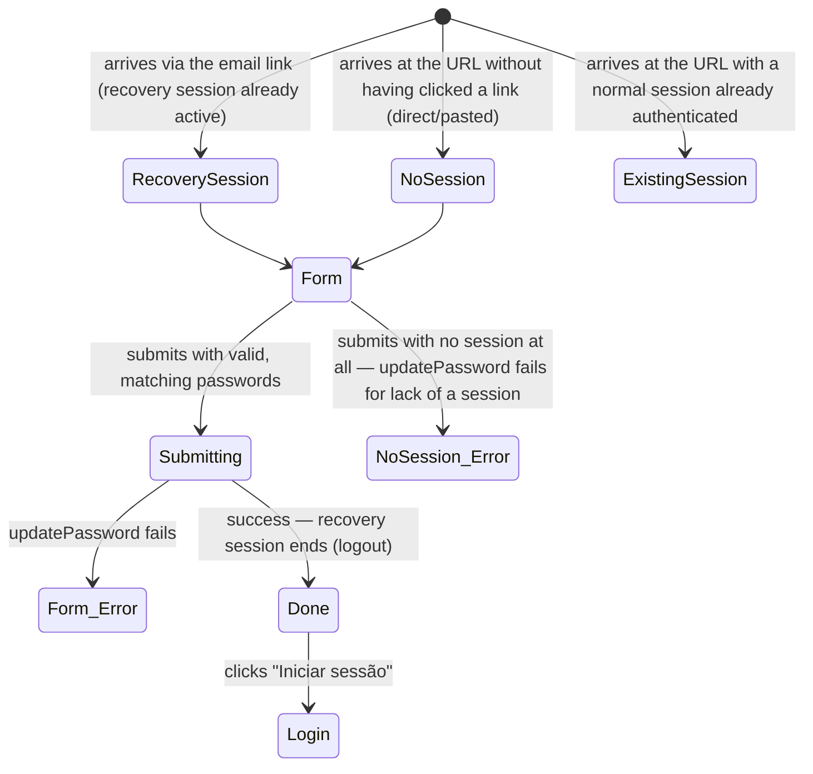

# Reset password

**Route:** `/reset-password` (public, outside the app shell)
**Guards:** none — it doesn't even check whether an active recovery session exists before showing
the form (see Flow 6 and 7)
**Components:** `ResetPasswordPageComponent`
**Depends on:** `AuthService.updatePassword()`, `AuthService.logout()`, `ToastService`
**Real entry point:** **not a click inside the app.** Supabase sends an email with a link to
`reset-password` (`AuthService.requestPasswordReset()`, see
[`forgot-password.md`](forgot-password.md)) that, when opened, establishes a recovery session
before Angular even loads. There's no button or link on any screen of the app that brings the user
directly here.

So the "entry point is always via login" rule applies to the full narrative (login → forgot
password → email → here), not to a clickable path within a single browser session — see the note
for `rally-e2e-test` at the end on how to simulate the email step.

## User flows

### Flow 1 — Successfully reset the password (full journey from login)
**Profile:** anonymous at first; gains a recovery session partway through
1. Opens `/login`.
2. Clicks "Esqueceste-te da password?" → `/forgot-password`.
3. Types the account's email and sends the request.
4. **(outside the app)** Opens the received email and clicks the reset link.
5. **Result:** arrives at `/reset-password` already with an active recovery session — the form is
   ready to use, no extra login step.
6. Types the new password into the "Nova password" field.
7. Types exactly the same into the "Confirmar password" field.
8. Clicks "Guardar password".
9. **Result:** the button changes to "A guardar…"; once done, the recovery session is closed
   (`AuthService.logout()`) and the screen switches to the success state ("password atualizada").
10. Clicks "Iniciar sessão".
11. **Result:** navigates to `/login`, with no active session — has to authenticate again, now
    with the new password.

### Flow 2 — Passwords don't match
**Profile:** active recovery session (arrived via Flow 1, steps 1-5)
1. Types a password into "Nova password".
2. Types something different into "Confirmar password".
3. **Result:** the inline message "as passwords não coincidem" appears below the second field; the
   "Guardar password" button stays disabled.

### Flow 3 — Password too short
**Profile:** active recovery session
1. Types a password with fewer than 6 characters into "Nova password".
2. **Result:** the inline message "password demasiado curta" appears; field has a red outline;
   button stays disabled even if "Confirmar password" has the same value.

### Flow 4 — Show/hide each password field independently
**Profile:** active recovery session
1. Types into "Nova password" and clicks its eye icon.
2. **Result:** only that field becomes visible in the clear; "Confirmar password" stays hidden.
3. Repeats on the "Confirmar password" field.
4. **Result:** the two toggles don't interfere with each other.

### Flow 5 — Fails to save (network/server error)
**Profile:** active recovery session
1. Fills in both passwords correctly, with the backend returning an error.
2. Clicks "Guardar password".
3. **Result:** stays on the form (doesn't advance to the success state); fields marked red; error
   toast with Supabase's raw text.

### Flow 6 — Direct access without a recovery session
**Profile:** anonymous, hasn't gone through Flow 1 (didn't click any email link)
1. Navigates directly to `/reset-password` (URL typed by hand, or an old/expired email link).
2. **Result:** the form shows up anyway — there's no client-side check that a valid recovery
   session exists.
3. Fills in both passwords and submits.
4. **Expected result:** `updatePassword()` fails (no session to update) — error toast, stays on the
   form. **This is the expected behavior, but it depends entirely on Supabase refusing the call;
   it's worth confirming experimentally that it actually fails, rather than just assuming it.**

### Flow 7 — A normal (non-recovery) session visits `/reset-password` directly
**Profile:** real account, normal login session already active (didn't come from a reset link)
1. With a normal session active, navigates directly to `/reset-password`.
2. Fills in both passwords and submits.
3. **Result to confirm:** `AuthService.updatePassword()` calls
   `supabase.auth.updateUser({ password })`, which acts on **any** active session — it doesn't
   appear to distinguish a "recovery" session from a normal login session. If that's the case, this
   changes the authenticated account's password **without asking for the current password**,
   unlike the equivalent flow inside the profile (`ProfilePageComponent` → change password, which
   requires the current password via `AuthService.changePassword()` before calling
   `updatePassword()`). This is worth checking deliberately — if confirmed, it's the most important
   finding on this screen.

---

**Notes for `rally-e2e-test`:** the full Flow 1 can't be automated with just Playwright clicking
through the app — step 4 (opening the email and clicking the link) needs a test mailbox that
Playwright can query (Mailhog/Mailosaur), or simulating arrival at the page with a recovery session
already established (calling the Supabase API directly to generate the recovery link/token and
navigating to it, without depending on a real email). Flows 2-5 don't need this — they run entirely
from the "already arrived with a recovery session" state, which can be set up directly in the test.
Flow 7 is the most important to confirm early, because it's about security, not UX.
