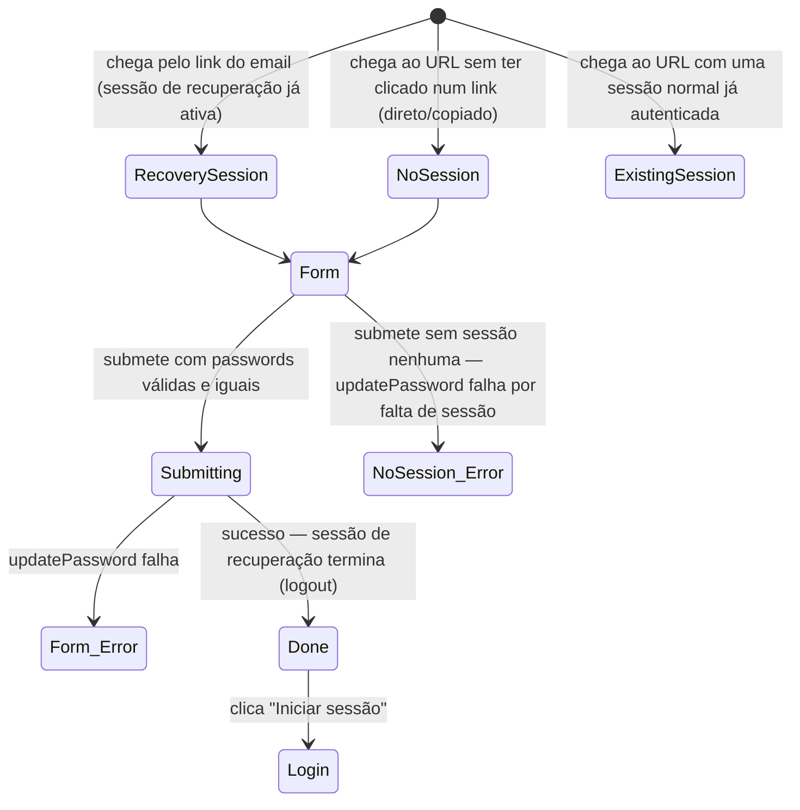

# Repor a password

**Rota:** `/reset-password` (pública, fora da app shell)
**Guards:** nenhum — nem sequer verifica se existe uma sessão de recuperação ativa antes de mostrar o formulário (ver Fluxo 6 e 7)
**Componentes:** `ResetPasswordPageComponent`
**Depende de:** `AuthService.updatePassword()`, `AuthService.logout()`, `ToastService`
**Ponto de entrada real:** **não é um clique dentro da app.** O Supabase envia um email com um link
para `reset-password` (`AuthService.requestPasswordReset()`, ver [`forgot-password.md`](forgot-password.md))
que, ao ser aberto, estabelece uma sessão de recuperação antes de o Angular sequer carregar. Não há
nenhum botão nem link em nenhum ecrã da app que traga o utilizador diretamente para aqui.

Por isso o "ponto de entrada é sempre pelo login" aplica-se à narrativa completa (login → esqueci-me
da password → email → aqui), não a um percurso clicável dentro de uma única sessão de browser — ver
a nota para o `rally-e2e-test` no fim sobre como simular o passo do email.

## Fluxos de utilizador

### Fluxo 1 — Repor a password com sucesso (jornada completa desde o login)
**Perfil:** anónimo no início; ganha uma sessão de recuperação a meio
1. Abre `/login`.
2. Clica "Esqueceste-te da password?" → `/forgot-password`.
3. Escreve o email da conta e envia o pedido.
4. **(fora da app)** Abre o email recebido e clica no link de reset.
5. **Resultado:** chega a `/reset-password` já com uma sessão de recuperação ativa — o formulário está pronto a usar, sem passo de login extra.
6. Escreve a password nova no campo "Nova password".
7. Escreve exatamente a mesma no campo "Confirmar password".
8. Clica "Guardar password".
9. **Resultado:** botão muda para "A guardar…"; ao terminar, a sessão de recuperação é fechada (`AuthService.logout()`) e o ecrã troca para o estado de sucesso ("password atualizada").
10. Clica "Iniciar sessão".
11. **Resultado:** navega para `/login`, sem sessão ativa — tem de voltar a autenticar-se, agora com a password nova.

### Fluxo 2 — Passwords não coincidem
**Perfil:** sessão de recuperação ativa (chegou pelo Fluxo 1, passos 1–5)
1. Escreve uma password no campo "Nova password".
2. Escreve algo diferente em "Confirmar password".
3. **Resultado:** aparece a mensagem inline "as passwords não coincidem" por baixo do segundo campo; botão "Guardar password" continua desativado.

### Fluxo 3 — Password demasiado curta
**Perfil:** sessão de recuperação ativa
1. Escreve uma password com menos de 6 caracteres no campo "Nova password".
2. **Resultado:** aparece a mensagem inline "password demasiado curta"; campo com contorno vermelho; botão desativado mesmo que "Confirmar password" tenha o mesmo valor.

### Fluxo 4 — Mostrar/ocultar cada campo de password independentemente
**Perfil:** sessão de recuperação ativa
1. Escreve em "Nova password" e clica o respetivo ícone de olho.
2. **Resultado:** só esse campo fica em claro; "Confirmar password" continua oculto.
3. Repete no campo "Confirmar password".
4. **Resultado:** os dois toggles não interferem um com o outro.

### Fluxo 5 — Falha ao guardar (erro de rede/servidor)
**Perfil:** sessão de recuperação ativa
1. Preenche as duas passwords corretamente, com o backend a devolver erro.
2. Clica "Guardar password".
3. **Resultado:** permanece no formulário (não avança para o estado de sucesso); campos marcados a vermelho; toast de erro com o texto em bruto do Supabase.

### Fluxo 6 — Acesso direto sem sessão de recuperação
**Perfil:** anónimo, sem ter passado pelo Fluxo 1 (não clicou em nenhum link de email)
1. Navega diretamente para `/reset-password` (URL escrito à mão, ou um link de email antigo/expirado).
2. **Resultado:** o formulário aparece na mesma — não há nenhuma verificação client-side de que existe uma sessão de recuperação válida.
3. Preenche as duas passwords e submete.
4. **Resultado esperado:** `updatePassword()` falha (sem sessão para atualizar) — toast de erro, permanece no formulário. **Isto é o comportamento esperado, mas depende inteiramente do Supabase recusar a chamada; vale a pena confirmar experimentalmente que falha mesmo, e não apenas assumir.**

### Fluxo 7 — Sessão normal (não de recuperação) visita `/reset-password` diretamente
**Perfil:** conta real, sessão de login normal já ativa (não veio de nenhum link de reset)
1. Com sessão normal ativa, navega diretamente para `/reset-password`.
2. Preenche as duas passwords e submete.
3. **Resultado a confirmar:** `AuthService.updatePassword()` chama `supabase.auth.updateUser({ password })`, que atua sobre **qualquer** sessão ativa — não parece distinguir uma sessão "de recuperação" de uma sessão normal de login. Se assim for, isto muda a password da conta autenticada **sem pedir a password atual**, ao contrário do fluxo equivalente dentro do perfil (`ProfilePageComponent` → mudar password, que exige a password atual via `AuthService.changePassword()` antes de chamar `updatePassword()`). Vale a pena verificar isto deliberadamente — se confirmado, é o achado mais importante deste ecrã.

---

**Notas para o `rally-e2e-test`:** o Fluxo 1 completo não é automatizável só com Playwright a clicar
na app — o passo 4 (abrir o email e clicar no link) precisa de uma caixa de correio de teste que o
Playwright consiga consultar (Mailhog/Mailosaur), ou de simular a chegada à página com uma sessão de
recuperação já estabelecida (chamar a API do Supabase diretamente para gerar o link/token de
recuperação e navegar para ele, sem depender de email real). Os Fluxos 2–5 não precisam disto —
correm inteiramente a partir do estado "já chegou com sessão de recuperação", que pode ser montado
diretamente no teste. O Fluxo 7 é o mais importante de confirmar cedo, porque é sobre segurança, não
sobre UX.
